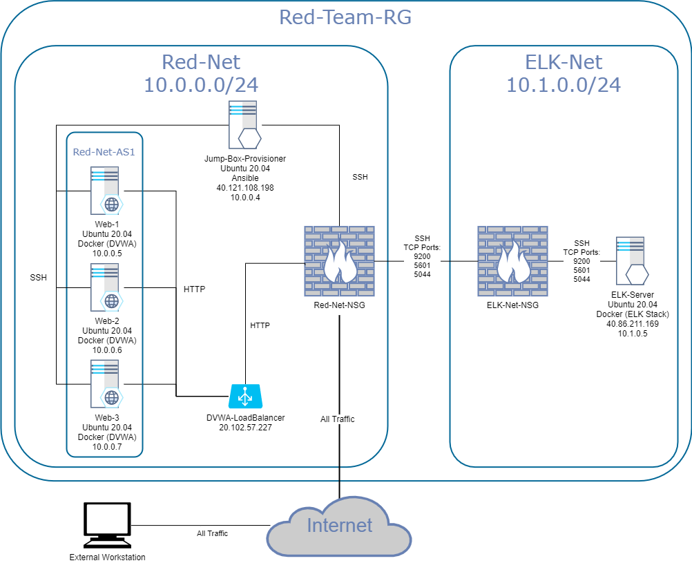

## Automated ELK Stack Deployment

The files in this repository were used to configure the network depicted below.

These files have been tested and used to generate a live ELK deployment on Azure. They can be used to either recreate the entire deployment pictured above. Alternatively, select portions of the [elk.yml](Ansible/elk.yml) file may be used to install only certain pieces of this deployment, such as Filebeat.

This document contains the following details:
- Description of the Topology
- Access Policies
- ELK Configuration
  - Beats in Use
  - Machines Being Monitored
- How to Use the Ansible Build

### Description of the Topology

The main purpose of this network is to expose a load-balanced and monitored instance of DVWA, the Damn Vulnerable Web Application.

Load balancing ensures that the application will be highly available, in addition to restricting unauthorized access to the network.

Integrating an ELK server allows users to easily monitor the vulnerable VMs for changes to the log data and system metrics.

The configuration details of each machine may be found below.

| Name                 | Function       | IP Address | Operating System |
|----------------------|----------------|------------|------------------|
| Jump-Box-Provisioner | Gateway        | 10.0.0.4   | Ubuntu 20.04     |
| ELK-Server           | Log Management | 10.1.0.5   | Ubuntu 20.04     |
| Web-1                | Web App Server | 10.0.0.5   | Ubuntu 20.04     |
| Web-2                | Web App Server | 10.0.0.6   | Ubuntu 20.04     |
| Web-3                | Web App Server | 10.0.0.7   | Ubuntu 20.04     |

### Access Policies

The machines on the internal network are not exposed to the public Internet. 

Only the 'Jump-Box-Provisioner' machine can accept connections from the Internet. Access to this machine is only allowed from the following IP addresses: 142.183.114.236/32

Machines within the network can only be accessed by 'Jump-Box-Provisioner' located at 10.0.0.4.

A summary of the access policies in place can be found in the table below.

| Name                 | Publicly Accessible | Allowed IP Addresses |
|----------------------|---------------------|----------------------|
| Jump-Box-Provisioner | Yes                 | 142.183.114.236      |
| ELK-Server           | No                  | 10.0.0.4             |
| Web-1                | No                  | 10.0.0.4             |
| Web-2                | No                  | 10.0.0.4             |
| Web-3                | No                  | 10.0.0.4             |

### Elk Configuration

Ansible was used to automate configuration of the ELK machine. No configuration was performed manually, which is advantageous for disaster recovery, scalability, and consistency across all infrastructure.

The playbook implements the following tasks:
- Installs all prerequisites on target machines in the ELK group
- Downloads ELK docker container and publishes relevant ports
- Ensures docker will run on system startup

The following screenshot displays the result of running `docker ps` after successfully configuring the ELK instance.

### Target Machines & Beats

This ELK server is configured to monitor the following machines:
- Web-1, 10.0.0.5
- Web-2, 10.0.0.6
- Web-3, 10.0.0.7

The following Beats have been installed on these machines:
- Filebeat
- Metricbeat

These Beats allow us to collect the following information from each machine:
- Filebeat collects specific log files from a target machine. In this configuration it will collect all files ending with .log in the /var/log/ directory of the target machine.
- Metricbeat collects system and service metrics of your choosing, such as CPU and memory usage, then sends this data to the central log management server. In this configuragtion Metricbeat is being used to collect docker container performance metrics.

### Using the Playbook

In order to use the playbook, you will need to have an Ansible control node already configured. Assuming you have such a control node provisioned: 

SSH into the control node and follow the steps below:
- Copy the [elk.yml](./Ansible/elk.yml) file to /etc/ansible on the ansible control node.
- Update the hosts file to include the [ELK] group and the ip adresses of any systems you wish to install the ELK stack on.
- Run the playbook, and navigate to http://[yourELKsystemIP]:5601 e.g. http://10.1.0.5:5601 to check that the installation worked as expected.
